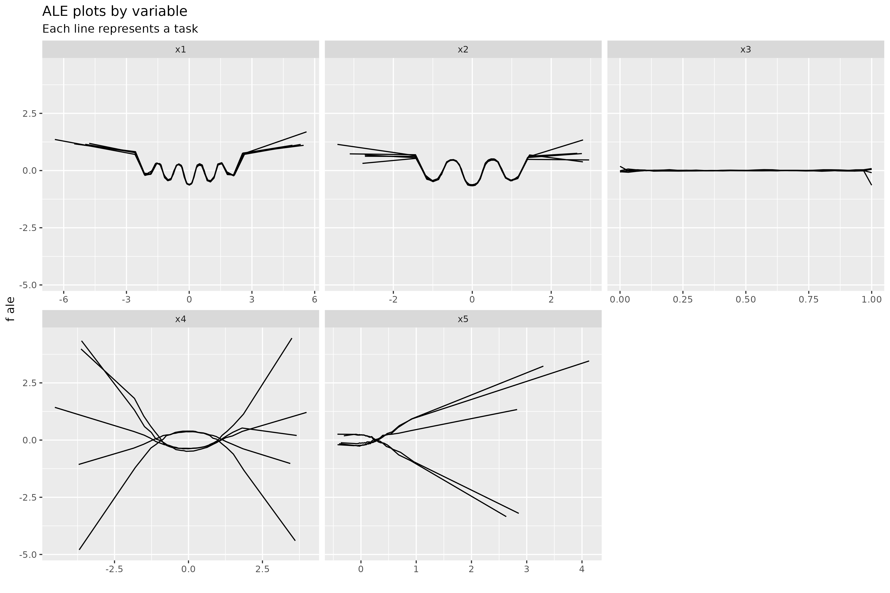

```{r setup, include=FALSE}
knitr::opts_chunk$set(echo = TRUE)
```


## OBJETIVO

> El objetivo es el de construir una meta-explicabilidad de distintos modelos.

Se tendrán distintas tareas y, para cada una de ellas, un modelo entrenado a partir de sus propios datos. El objetivo que se persigue es el de encontrar una estructura común que sirva como meta-expicabilidad de los modelos. Sería la explicabilidad pero aplicada a *multitask learning* [@learning1998].

## SIMULACIÓN DE DATOS

Actualmente, para probar las ideas se generan 5 tareas con 10,000 observaciones de forma que

| Tarea | $X_1$ y $X_2$                                                      | $X_3$      | $X_4$      | $X_5$                          | $Y$                                                   |
|:----------:|------------|------------|------------|------------|------------|
|   1   | `mvrnorm(n, mu = c(0, 0), Sigma = matrix(c(2, 1, .05, .6), 2, 2))` | `runif(n)` | `rnorm(n)` | `.2*x4**2 + rnorm(n, sd = .1)` | `std(rastrigin(x1, x2)) + std(x4**2 + x5**2 + x4*x5)` |
|   2   | `mvrnorm(n, mu = c(0, 0), Sigma = matrix(c(2, 1, .05, .6), 2, 2))` | `runif(n)` | `rnorm(n)` | `.2*x4**2 + rnorm(n, sd = .1)` | `std(rastrigin(x1, x2)) + std(x4**2 + x5**2 + x4*x5)` |
|   3   | `mvrnorm(n, mu = c(0, 0), Sigma = matrix(c(2, 1, .05, .6), 2, 2))` | `runif(n)` | `rnorm(n)` | `.2*x4**2 + rnorm(n, sd = .1)` | `std(rastrigin(x1, x2)) + std(x4**2 + x5**2 + x4*x5)` |
|   4   | `mvrnorm(n, mu = c(0, 0), Sigma = matrix(c(2, 1, .05, .6), 2, 2))` | `runif(n)` | `rnorm(n)` | `.2*x4**2 + rnorm(n, sd = .1)` | `std(rastrigin(x1, x2)) + std(x4**2 + x5**2 + x4*x5)` |
|   5   | `mvrnorm(n, mu = c(0, 0), Sigma = matrix(c(2, 1, .05, .6), 2, 2))` | `runif(n)` | `rnorm(n)` | `.2*x4**2 + rnorm(n, sd = .1)` | `std(rastrigin(x1, x2)) + std(x4**2 + x5**2 + x4*x5)` |

donde

-   `std()` se refiere a la estandarización de media 0 y desviación típica 1 y

-   `rastrigin()` es la [función de Rastrigin](https://en.wikipedia.org/wiki/Rastrigin_function)

Como comentarios:

-   Las variables $X_1$ y $X_2$ se obtienen a partir de una **distribución normal multivariante.**
-   $X_3$ se obtiene a partir de una **distribución uniforme entre 0 y 1.**
-   $X_4$ se obtiene a partir de una **distribución normal de media 0 y desviación típica 1.**
-   $X_5$ se obtiene a como una transformación cuadrática creciente a partir de $X_4$ añadiendo un error aleatorio normal.
-   La variable objetivo $Y$ se obtiene con el resultado de aplicar la función de Rastrigin para $X_1$ y $X_2$ (estandariazado) más una transformación cuadrática utilizando las variables $X_4$ y $X_5$.
-   La variable $X_3$ no interviene en la generación de la variable objetivo.

En general, el comportamiento de las variables con respecto a la variable objetivo

-   Dos variables estarán muy correladas y tendrán un patrón similar para todas las tareas,
-   Una variable que no contribuya a la variable objetivo y
-   Dos variables que sigan un patrón distinto para cada tarea y correladas.

## METAEXPLICABILIDAD

Idea general:

-   Entrenar un modelo para cada tarea. *(TODO: Ahora mismo se entrena cada tarea independiente del resto. Podría ser interesante aplicar multi-task learning)*
-   Buscar una estructura general que sea aplicable (en cierto grado) para todas las tareas. Esto debe incluir:
    -   Diferenciar variables que siguen un patrón similar para todas las tareas (actualmente serían las variables $X_1$ y $X_2$),
    -   diferenciar variables que no influyen (son irrelevantes) para todas las tareas (variable $X_3$)
    -   diferencias variables con patrones distintos para cada tarea ($X_4$ y $x_5$).

Como primer ensayo, se ha aplicado **ALE plots** [@apley2020] por separado para cada tarea y se han superpuesto los gráficos para cada variable.



> **Nota 1:** para la interpretación de los ALE plots, ver el [@apley2020]artículo original o este [capítulo](https://christophm.github.io/interpretable-ml-book/ale.html)

> **Nota 2:** actualmente se ha entrenado un Random Forest para cada tarea dejando por defecto los hiperparámetros que utiliza la función del paquete `randomForest`.

Se ven claramente los patrones de cada variable así como los generales. ¿Habría una forma de automatizar el proceso? (Pensando en conjuntos de datos con un número alto de variables donde se discrimine de forma automática los distintos comporamientos descritos anteriormente).

## REFERENCIAS
